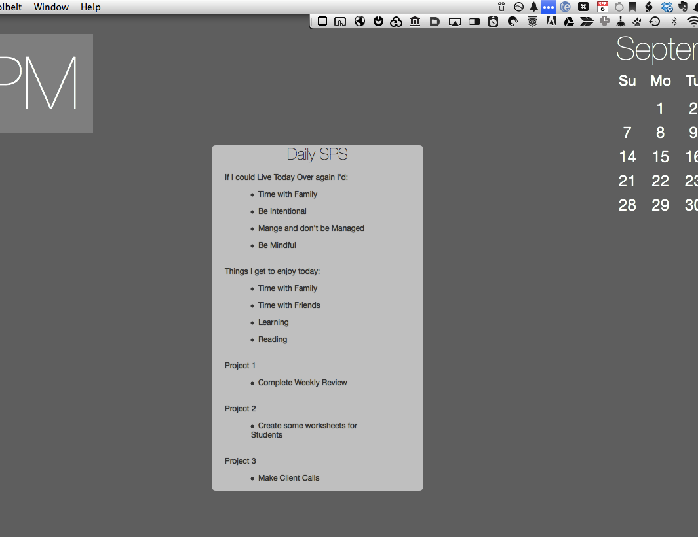

## Daily SPS for Übersicht

A widget for [Übersicht](http://tracesof.net/uebersicht/) that displays an abbreviated Storyline Productivity Schedule on my Desktop. 

### Using the Übersicht SPS Widget

Each morning I decide on what I would do over again if I had to relive that day. Whenever I discuss SPS with someone their first comment is **"I would not go to work"**. I skip this obvious item. By listing what I would do over again, it helps me focus on the important not urgent tasks in my life. With my do over items in mind, I review Omnifocus and select 3 tasks that I would like to accomplish each day. "Project 1" is the task that has my top priority and I focus on is first thing. 2 and 3 typically depend on the various fires that arise. By keeping the SPS on my screen, I feel the I can better focus on the Important.

### Adjusting Screen Placement

background-color: rgba(255,255,255,0.6)
  border-radius: 6px
  padding: 0px 20px
  top: 200px
  left: 40%
  color: #333
  font-family: Helvetica Neue

### Notes

This Widget is my own abbreviated version for the [Storyline Productivity Schedule](http://www.storylineblog.com/storyline-productivity-schedule.pdf "Storyline Productivity Schedule PDF"). 

I also need to give credit to [Brett Terpstra](http://brettterpstra.com "BrettTerpstra.com") and his great podcast, [Systematic](http://5by5.tv/systematic "5by5 | Systematic"), where I first heard of [Übersicht](http://tracesof.net/uebersicht/)